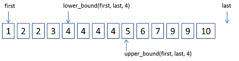

# README

## Binary Search

```js
function binarySearch(arr, target) {}
```

Return index of element that is matched with target.



## Lower Bound

```js
function lowerBound(arr, target) {}
```

Return first element that is greater or equal to the target in a non-decreasing array.

## Upper Bound

```js
function upperBound(arr, target) {}
```

Return first element that is greater than the target in a non-decreasing array.

## Reference

- [https://kkc.github.io/2019/03/28/learn-loop-invariant-from-binary-search/](https://kkc.github.io/2019/03/28/learn-loop-invariant-from-binary-search/)
