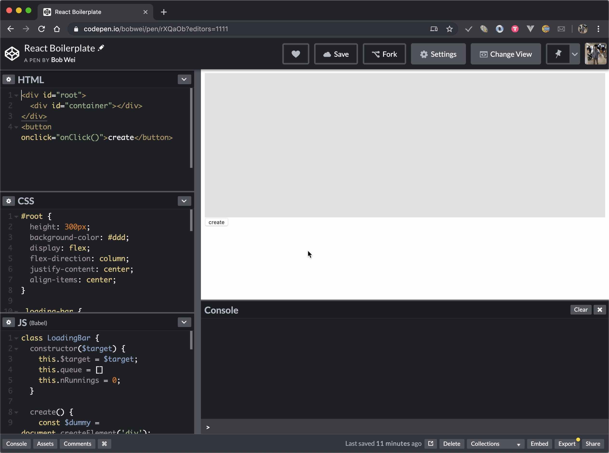

# README

## Uber front end interview

1. Implement a loading bar that animates from 0 to 100% in 3 seconds
2. Start loading bar animation upon a button click
3. Queue multiple loading bars if the button is clicked more than once. Loading bar N starts animating with loading bar N-1 is done animating.

- https://codepen.io/bobwei/pen/rXQaOb

